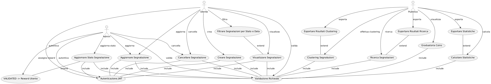

# Crowdmapping di Buche Stradali - Backend

## Obiettivo del Progetto

Il progetto ha l'obiettivo di sviluppare un backend utilizzando Express per un sistema di Crowdmapping dedicato alla segnalazione di buche stradali.

## Requisiti Funzionali

### Creazione Segnalazione
- Gli utenti devono poter creare una nuova segnalazione, fornendo i seguenti campi:
  - **Data e ora della segnalazione** (opzionale; se non fornita, viene utilizzata la data e ora correnti).
  - **Posizione** (latitudine e longitudine).
  - **Tipologia del difetto stradale** (es. buca, avvallamento).
  - **Severità del difetto stradale** (es. poco profonda, profonda, molto profonda).
- Lo stato della segnalazione deve essere impostato a **PENDING** al momento della creazione.

### Aggiornamento e Cancellazione Segnalazione
- Gli utenti devono avere la possibilità di aggiornare o cancellare solo le segnalazioni che hanno creato.
- Gli amministratori possono modificare lo stato delle segnalazioni.

### Verifica Stato Segnalazione
- Gli utenti possono verificare lo stato delle proprie segnalazioni, con possibilità di filtrare per stato (PENDING, VALIDATED, REJECTED) e per range di date.

### Aggiornamento Stato da parte dell'Amministratore
- Gli amministratori possono cambiare lo stato delle segnalazioni da PENDING a VALIDATED o REJECTED, con possibilità di aggiornare lo stato in modalità bulk.

### Reward per Segnalazioni Accettate
- Ogni segnalazione accettata (VALIDATED) fornisce all'utente una ricompensa di **0.1 coins**.
- Se l'utente ha più di 10 segnalazioni VALIDATED, la ricompensa aumenta a **0.15 coins**.

### Accesso alla Graduatoria
- Gli utenti possono accedere a una graduatoria pubblica ordinata in base ai “coins” guadagnati, visualizzabile in modo ascendente o discendente.

### Calcolo Statistiche Segnalazioni
- È possibile calcolare e visualizzare statistiche delle segnalazioni per ogni tipologia di difetto e severità, con numero di segnalazioni PENDING, VALIDATED e REJECTED.
- I risultati possono essere esportati in formato JSON, CSV o PDF.

### Clustering delle Segnalazioni
- Il sistema esegue clustering delle segnalazioni VALIDATED utilizzando l'algoritmo **DBSCAN**.
- I risultati possono essere esportati in formato JSON, CSV o PDF.

### Restituzione Segnalazioni VALIDATED
- È possibile restituire le segnalazioni VALIDATED filtrando per tipologia e intensità, fornendo una posizione e un raggio di ricerca in metri, con opzione di filtro anche per range di date.
- I dati possono essere esportati in formato JSON o CSV.

### Validazione delle Richieste
- Tutte le richieste devono essere validate, gestendo errori come:
  - Segnalazione non esistente.
  - Payload non corretti (es. latitudine e longitudine non ammissibili).
  - Date e ore in formati non riconosciuti.

### Gestione dei Token JWT
- Ogni utente autenticato ha un numero predefinito di token (impostato nel seed del database).
- Se il numero di token è terminato, ogni richiesta dell'utente restituirà un errore **401 Unauthorized**.
- I token JWT devono contenere solo i dati essenziali e il numero residuo di token deve essere memorizzato nel database.

### Script di Seed
- Sono previsti script di seed per inizializzare il sistema.

### Middleware e Gestione Errori
- Si utilizzano funzionalità di middleware per gestire errori e sollevare eccezioni appropriate.

## Specifiche Tecniche

- Utilizzo di **Sequelize** come ORM per la gestione del database (RDBMS a scelta).
- Utilizzo di librerie per **DBSCAN** per il clustering delle segnalazioni.
- Implementazione di un sistema di autenticazione tramite **JWT**.
- Progettazione di un'API **RESTful** per la gestione delle segnalazioni e delle statistiche.

## Progettazione

### Struttura del Progetto

Il progetto è composto da un servizio backend basato su Node.js con Express che si interfaccia con un database **Postgres** e utilizza una cache **Redis** per mediare gli accessi al database.

├── app
│ └── src
│ ├── database
│ │ ├── models
│ │ └── repository
│ ├── errors
│ ├── middlewares
│ ├── routes
│ └── services
├── db
│ └── initdb
└── test


### Cartella `database`
- **models**: Estensione della classe `Model` di Sequelize per definire le entità principali (Role, User, Report).
- Definizione di una classe generica **Dao** per gestire operazioni base con il database utilizzando metodi di Sequelize mediati da una logica di cache LRU tramite Redis.

### Cartella `repository`
- Ogni modello ha un proprio repository (Role, User, Report) contenente metodi dedicati alla manipolazione dei dati senza preoccuparsi della validazione.

### Cartella `services`
- Contiene i controller con la validazione delle richieste per "Role", "User", "Report" e una classe per "Export".

## Diagrammi UML

### Casi d'uso

@startuml
actor "Utente" as User
actor "Admin" as Admin
actor "Pubblico" as Public

usecase "Creare Segnalazione" as UC1
usecase "Aggiornare Segnalazione" as UC2
usecase "Cancellare Segnalazione" as UC3
usecase "Visualizzare Segnalazioni" as UC4
usecase "Filtrare Segnalazioni per Stato e Data" as UC4a
usecase "Aggiornare Stato Segnalazione" as UC5
usecase "VALIDATED -> Reward Utente" as UC5a
usecase "Graduatoria Coins" as UC6
usecase "Calcolare Statistiche" as UC7
usecase "Esportare Statistiche" as UC7a
usecase "Clustering Segnalazioni" as UC8
usecase "Esportare Risultati Clustering" as UC8a
usecase "Ricerca Segnalazioni" as UC9
usecase "Esportare Risultati Ricerca" as UC9a
usecase "Autenticazione JWT" as UC10
usecase "Validazione Richieste" as UC11

User --> UC1 : crea
User --> UC2 : aggiorna
User --> UC3 : cancella
User --> UC4 : visualizza
User --> UC4a : filtra
User --> UC10 : autentica
User --> UC11 : valida

Admin --> UC2 : aggiorna
Admin --> UC3 : cancella
Admin --> UC5 : aggiorna stato
Admin --> UC5a : assegna reward
Admin --> UC10 : autentica
Admin --> UC11 : valida

Public --> UC6 : visualizza
Public --> UC7 : calcola
Public --> UC7a : esporta
Public --> UC8 : effettua clustering
Public --> UC8a : esporta
Public --> UC9 : ricerca
Public --> UC9a : esporta

UC1 -down- UC10 : include
UC1 -down- UC11 : include
UC2 -down- UC10 : include
UC2 -down- UC11 : include
UC3 -down- UC10 : include
UC3 -down- UC11 : include
UC4 -down- UC10 : include
UC4 -down- UC11 : include
UC4a -down- UC4 : extend
UC5 -down- UC10 : include
UC5 -down- UC11 : include
UC5 -down- UC5a : extend
UC6 -down- UC11 : include
UC7 -down- UC11 : include
UC7a -down- UC7 : extend
UC8 -down- UC11 : include
UC8a -down- UC8 : extend
UC9 -down- UC11 : include
UC9a -down- UC9 : extend
@enduml


## Diagramma delle Sequenze


@startuml
actor Client
participant "Express App" as App
participant "loggerMiddleware" as Logger
participant "reqValidate" as ReqValidate
participant "resBuild" as ResBuild
participant "resSendFile" as ResSendFile
participant "filterRequestMiddleware" as FilterMiddleware
participant "Routes" as Routes
participant "Auth Middleware" as AuthMiddleware
participant "Cache (Redis)" as Cache
participant "Database (Postgres)" as Database
participant "errorHandlerMiddleware" as ErrorHandler

Client -> App: Invio Richiesta
App -> Logger: Logga la richiesta
App -> ReqValidate: Aggiungi metodo alla richiesta
App -> ResBuild: Aggiungi metodo alla risposta
App -> ResSendFile: Aggiungi metodo alla risposta
App -> FilterMiddleware: Verifica metodo e header

note right of App: Passaggio della richiesta alle rotte

App -> Routes: Gestisci richiesta

alt Autenticazione necessaria
    Routes -> AuthMiddleware: Verifica autenticazione (jwt hmac/jwt rsa)
end

alt Richiesta di lettura
    Routes -> Cache: Controlla se i dati sono in cache
    alt Dati presenti in cache
        Cache -> Routes: Restituisce dati dalla cache
    else Dati non presenti in cache
        Routes -> Database: Leggi dati dal database
        Database -> Routes: Restituisce dati
        Routes -> Cache: Salva dati in cache
    end
else Richiesta di scrittura
    Routes -> Database: Scrivi dati
    Database -> Routes: Conferma scrittura
    Routes -> Cache: Invalida cache
end
@enduml


## Pattern Usati

I seguenti **pattern di design** sono stati utilizzati nel progetto:

- **DAO**: Utilizzato con logica di cache per gestire le operazioni sul database.
- **Singleton**: Utilizzato per la connessione al database e alla cache.
- **Factory**: La **ErrorFactory** permette di creare errori personalizzati.
- **Builder**: La classe **BaseError** estende `Error` e definisce metodi per specializzare gli errori in modo flessibile.
- **Async/Await**: Utilizzato per gestire operazioni asincrone in modo più leggibile.

## Come Avviare il Progetto

Per avviare il progetto, sono disponibili due script: `start.sh` e `restart.sh`.

### `start.sh`

Questo script è progettato per avviare l'applicazione da zero. Esegue le seguenti operazioni:

1. **Rimuove tutte le immagini e i volumi** associati a Docker Compose.
2. **Crea e avvia i servizi** definiti nel file `docker-compose.yml`.

Utilizza questo script quando desideri iniziare una nuova istanza del servizio e garantire che non ci siano conflitti con dati o immagini precedenti.

**Esempio di utilizzo:**

```bash
sh ./start.sh

### `restart.sh`

Questo script è utilizzato per riavviare i servizi esistenti senza cancellare le immagini o i volumi. È utile quando si desidera applicare modifiche senza dover ripulire l'ambiente completamente.

**Esempio di utilizzo:**

```bash
sh ./restart.sh

## Testare le API

Dopo aver avviato il progetto, puoi eseguire i test delle API utilizzando Newman (l'interfaccia della riga di comando per Postman) con i seguenti comandi:

**Esempio di utilizzo:**

```bash
newman run app/pothole_crowdmapping.postman_collection.json -e app/pothole_crowdmapping.postman_environment.json


## Licenza

Questo progetto è distribuito sotto la Licenza MIT. Puoi consultare il file `LICENSE` per maggiori dettagli.

## Roadmap
# Potenziali sviluppi per il progetto

- **Sviluppo di un frontend**: Creazione di un'interfaccia utente per facilitare l'interazione con il sistema e migliorare l'esperienza dell'utente.
- **Postgis**: Gestione dati spaziali tramite funzionalità tramite l'estensione di postgres.
- **Aggiunta di nuove funzionalità**: Sviluppo di nuove API per migliorare l'interazione con il sistema.
- **Ottimizzazione della performance**: Analisi e miglioramenti delle performance del sistema, inclusa la logica di caching.
- **Integrazione con servizi esterni**: Collaborazione con servizi di terze parti per migliorare la raccolta dei dati.
- **Implementazione di un sistema di autenticazione**: Aggiunta di funzionalità di sicurezza per proteggere le API.
- **Documentazione dettagliata**: Creazione di una documentazione più completa e tutorial per gli utenti.
- **Test automatizzati**: Sviluppo di test automatizzati per garantire la stabilità del sistema.


Propositi per il prossimo progetto-> 
    - riconfermare struttura progetto. la strutturazione di cartelle e codice nei file potrebbe essere migliorata
    - estendere la logica del middleware reqValidate anche a req.params e req.query oltre che al req.body per impostare una validazione di base e gestire i casi particolari con una classe a parte cosi da evitare la crescita dei file services


# 🚧 Crowdmapping di Buche Stradali - Backend 🚧


## 🎯 Obiettivo del Progetto

Sviluppare un backend con **Express** per un sistema di **Crowdmapping** dedicato alla segnalazione di buche stradali.


## 📋 Requisiti Funzionali

### 📍 Creazione Segnalazione
- Gli utenti possono creare segnalazioni con:
  - **Data e ora** (opzionale).
  - **Posizione** (latitudine e longitudine).
  - **Tipologia** (es. buca, avvallamento).
  - **Severità** (poco profonda, profonda, molto profonda).
  - Stato iniziale: **PENDING**.

### ✏️ Aggiornamento e Cancellazione
- Utenti: aggiornamento/cancellazione solo delle proprie segnalazioni.
- Admin: modifica stato delle segnalazioni.

### 🔍 Verifica Stato Segnalazione
- Utenti: verificare stato delle segnalazioni, filtrare per stato e data.

### 🔄 Aggiornamento Stato da Admin
- Admin: cambio stato da **PENDING** a **VALIDATED** o **REJECTED**, anche in modalità bulk.

### 💰 Reward per Segnalazioni Accettate
- **0.1 coins** per segnalazione **VALIDATED**.
- Più di 10 segnalazioni **VALIDATED**: **0.15 coins**.

### 🏆 Accesso alla Graduatoria
- Graduatoria pubblica ordinata per **coins** guadagnati (ascendente o discendente).

### 📊 Calcolo Statistiche Segnalazioni
- Statistiche per tipologia e severità.
- Esportazione in **JSON**, **CSV** o **PDF**.

### 🗺️ Clustering delle Segnalazioni
- Clustering con **DBSCAN** per segnalazioni **VALIDATED**.
- Esportazione risultati in **JSON**, **CSV** o **PDF**.

### 🌍 Restituzione Segnalazioni VALIDATED
- Filtrare per tipologia, intensità, posizione e raggio, anche per range di date.
- Esportazione in **JSON** o **CSV**.

### ✅ Validazione delle Richieste
- Validazione di tutte le richieste.
- Gestione errori: segnalazione non esistente, payload errati, formati non riconosciuti.

### 🔐 Gestione dei Token JWT
- Autenticazione utenti con token JWT.
- Numero di token predefinito (dal seed del database).
- **401 Unauthorized** se i token sono esauriti.

### 📦 Script di Seed
- Script per inizializzare il sistema.

### ⚙️ Middleware e Gestione Errori
- Middleware per gestire errori e sollevare eccezioni appropriate.

## 🛠️ Specifiche Tecniche

- **Sequelize** per ORM e gestione database.
- **DBSCAN** per clustering.
- **JWT** per autenticazione.
- API **RESTful** per gestione segnalazioni e statistiche.

## 🏗️ Progettazione

### 📂 Struttura del Progetto

Backend in **Node.js** con **Express** che interagisce con un database **Postgres** e utilizza una cache **Redis**.
### Cartella `database`

- **`models`**: 
  - Estensione della classe `Model` di Sequelize per definire le entità principali (Role, User, Report).
  
- Definizione di una classe generica **`Dao`** per gestire operazioni base con il database utilizzando metodi di Sequelize mediati da una logica di cache LRU tramite Redis.

---

### Cartella `repository`

- Ogni modello ha un proprio repository (Role, User, Report) contenente metodi dedicati alla manipolazione dei dati senza preoccuparsi della validazione.

---

### Cartella `services`

- Contiene i controller con la validazione delle richieste per "Role", "User", "Report" e una classe per "Export".
 


## 📊 Diagrammi UML

### 🗂️ Casi d'uso

@startuml
actor "Utente" as User
actor "Admin" as Admin
actor "Pubblico" as Public

usecase "Creare Segnalazione" as UC1
usecase "Aggiornare Segnalazione" as UC2
usecase "Cancellare Segnalazione" as UC3
usecase "Visualizzare Segnalazioni" as UC4
usecase "Filtrare Segnalazioni per Stato e Data" as UC4a
usecase "Aggiornare Stato Segnalazione" as UC5
usecase "VALIDATED -> Reward Utente" as UC5a
usecase "Graduatoria Coins" as UC6
usecase "Calcolare Statistiche" as UC7
usecase "Esportare Statistiche" as UC7a
usecase "Clustering Segnalazioni" as UC8
usecase "Esportare Risultati Clustering" as UC8a
usecase "Ricerca Segnalazioni" as UC9
usecase "Esportare Risultati Ricerca" as UC9a
usecase "Autenticazione JWT" as UC10
usecase "Validazione Richieste" as UC11

User --> UC1 : crea
User --> UC2 : aggiorna
User --> UC3 : cancella
User --> UC4 : visualizza
User --> UC4a : filtra
User --> UC10 : autentica
User --> UC11 : valida

Admin --> UC2 : aggiorna
Admin --> UC3 : cancella
Admin --> UC5 : aggiorna stato
Admin --> UC5a : assegna reward
Admin --> UC10 : autentica
Admin --> UC11 : valida

Public --> UC6 : visualizza
Public --> UC7 : calcola
Public --> UC7a : esporta
Public --> UC8 : effettua clustering
Public --> UC8a : esporta
Public --> UC9 : ricerca
Public --> UC9a : esporta

UC1 -down- UC10 : include
UC1 -down- UC11 : include
UC2 -down- UC10 : include
UC2 -down- UC11 : include
UC3 -down- UC10 : include
UC3 -down- UC11 : include
UC4 -down- UC10 : include
UC4 -down- UC11 : include
UC4a -down- UC4 : extend
UC5 -down- UC10 : include
UC5 -down- UC11 : include
UC5 -down- UC5a : extend
UC6 -down- UC11 : include
UC7 -down- UC11 : include
UC7a -down- UC7 : extend
UC8 -down- UC11 : include
UC8a -down- UC8 : extend
UC9 -down- UC11 : include
UC9a -down- UC9 : extend
@enduml


### 🕸️ Diagramma delle Sequenze

@startuml
actor Client
participant "Express App" as App
participant "loggerMiddleware" as Logger
participant "reqValidate" as ReqValidate
participant "resBuild" as ResBuild
participant "resSendFile" as ResSendFile
participant "filterRequestMiddleware" as FilterMiddleware
participant "Routes" as Routes
participant "Auth Middleware" as AuthMiddleware
participant "Cache (Redis)" as Cache
participant "Database (Postgres)" as Database
participant "errorHandlerMiddleware" as ErrorHandler

Client -> App: Invio Richiesta
App -> Logger: Logga la richiesta
App -> ReqValidate: Aggiungi metodo alla richiesta
App -> ResBuild: Aggiungi metodo alla risposta
App -> ResSendFile: Aggiungi metodo alla risposta
App -> FilterMiddleware: Verifica metodo e header

note right of App: Passaggio della richiesta alle rotte

App -> Routes: Gestisci richiesta

alt Autenticazione necessaria
    Routes -> AuthMiddleware: Verifica autenticazione (jwt hmac/jwt rsa)
end

alt Richiesta di lettura
    Routes -> Cache: Controlla se i dati sono in cache
    alt Dati presenti in cache
        Cache -> Routes: Restituisce dati dalla cache
    else Dati non presenti in cache
        Routes -> Database: Leggi dati dal database
        Database -> Routes: Restituisce dati
        Routes -> Cache: Salva dati in cache
    end
else Richiesta di scrittura
    Routes -> Database: Scrivi dati
    Database -> Routes: Conferma scrittura
    Routes -> Cache: Invalida cache
end
@enduml

## 🎨 Pattern Usati

- **DAO**: Operazioni sul database con logica di cache.
- **Singleton**: Connessione al database e cache.
- **Factory**: Creazione di errori personalizzati.
- **Builder**: Specializzazione degli errori.
- **Async/Await**: Gestione asincrona delle operazioni.

## 🚀 Come Avviare il Progetto


### 🌟 Documentazione delle Variabili d'Ambiente

-**🔧 Variabili di Esempio**

```env
# Configurazione dell'Ambiente
NODE_ENV=development          # Modalità dell'ambiente: development, production, ecc.
API_VERSION=/api/v1           # Versionamento dell'API
API_PORT=5003                 # Porta interna dell'API
EXT_API_PORT=8003             # Porta esterna dell'API

# Credenziali dell'Amministratore
ADMIN_EMAIL=admin_email@email.com      # Email dell'amministratore
ADMIN_PASSWORD=admin_secret_password   # Password dell'amministratore

# Chiavi di Autenticazione
# RSA_AUTH_KEY=true per l'autenticazione RSA
# RSA_AUTH_KEY=test per il test RSA Newman collection
# RSA_AUTH_KEY=<qualsiasi altro valore> per l'autenticazione HMAC
RSA_AUTH=

# Configurazione JWT
JWT_SECRET_KEY=my_jwt_secret_key   # Chiave segreta per JWT
JWT_EXP_H=24                       # Tempo di scadenza del JWT in ore

# Headers Personalizzati
EXPECTED_FILTER_HEADER=my_filter_header_key   # Header personalizzato per il filtraggio delle richieste

# Configurazione del Database
DB_USER=myuser           # Nome utente del database
DB_PASSWORD=mypassword   # Password del database
DB_NAME=mydatabase       # Nome del database

# Configurazione Redis
REDIS_URL=redis          # URL di Redis
REDIS_PORT=6379          # Porta di Redis
```

🌍 Configurazione dell'Ambiente

- **`NODE_ENV`**: Definisce la modalità dell'ambiente. Valori comuni includono `development`, `production`, `test`.
- **`API_VERSION`**: Specifica la versione dell'API. Es., `/api/v1`.
- **`API_PORT`**: Porta su cui girerà il server API interno.
- **`EXT_API_PORT`**: Porta esposta esternamente per l'accesso all'API.

👩‍💼 Credenziali dell'Amministratore

- **`ADMIN_EMAIL`**: Indirizzo email dell'amministratore del sistema.
- **`ADMIN_PASSWORD`**: Password per l'account dell'amministratore.

🔑 Chiavi di Autenticazione

- **`RSA_AUTH`**: 
  - `true` per l'autenticazione RSA.
  - `test` per il test della Newman collection RSA.
  - Qualsiasi altro valore per l'autenticazione HMAC.

🔒 Configurazione JWT

- **`JWT_SECRET_KEY`**: Chiave segreta usata per firmare i JSON Web Token (JWT).
- **`JWT_EXP_H`**: Tempo di scadenza del JWT in ore.

🚀 Headers Personalizzati

- **`EXPECTED_FILTER_HEADER`**: Chiave dell'header personalizzato usato per filtrare le richieste.

💾 Configurazione del Database

- **`DB_USER`**: Nome utente per il database.
- **`DB_PASSWORD`**: Password per l'utente del database.
- **`DB_NAME`**: Nome del database a cui connettersi.

⚡ Configurazione Redis

- **`REDIS_URL`**: URL per il server Redis.
- **`REDIS_PORT`**: Numero di porta per il server Redis.


### `start.sh`

1. Rimuove immagini e volumi Docker Compose.
2. Gestisce la generazione della chiave rsa se la variabile d'ambiente RSA_AUTH_KEY=true.
3. Crea e avvia i servizi.

**Esempio:**
```bash
sh ./start.sh
```

### `restart.sh`

Riavvia i servizi esistenti senza cancellare immagini o volumi del docker-compose.

**Esempio:**
```bash
sh ./restart.sh
```

## 🧪 Testare le API

Utilizza **Newman** per eseguire i test delle API.

**Esempio di test newman runnato dalla root del progetto:**
```bash
newman run app/pothole_crowdmapping.postman_collection.json -e app/pothole_crowdmapping.postman_environment.json
```

## 📜 Licenza

Distribuito sotto la **Licenza MIT**. Consulta il file `LICENSE` per maggiori dettagli.

## 🌟 Roadmap

- **Frontend**: Creazione di un'interfaccia utente.
- **Postgis**: Gestione dati spaziali con Postgres.
- **Nuove funzionalità**: Sviluppo di nuove API.
- **Ottimizzazione performance**: Miglioramenti e caching.
- **Integrazione esterna**: Collaborazione con servizi di terze parti.
- **Sicurezza**: Implementazione di un sistema di autenticazione.
- **Documentazione**: Tutorial e documentazione dettagliata.
- **Test automatizzati**: Sviluppo di test per garantire la stabilità del sistema.

## 📝 Propositi per il Prossimo Progetto

- Riconfermare la bontà della struttura/architettura del progetto 
- Estendere/Modificare logica del middleware `reqValidate` con validazione anche base per `req.params` e `req.query` +  Gestione casi particolari nei controller con classe a parte metodi specifici di validazione