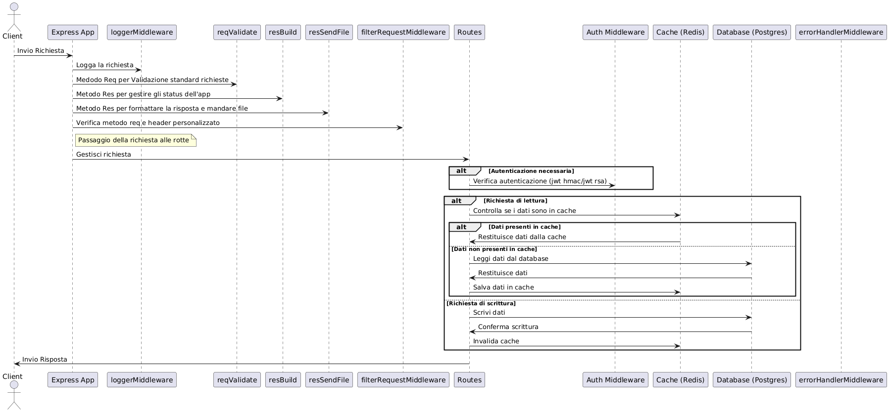

# 🚧 Crowdmapping di Buche Stradali - Backend 🚧


## 🎯 Obiettivo del Progetto

Sviluppare un backend con **Express** per un sistema di **Crowdmapping** dedicato alla segnalazione di buche stradali.


## 📋 Requisiti Funzionali

### 📍 Creazione Segnalazione
- Gli utenti possono creare segnalazioni con:
  - **Data e ora** (opzionale).
  - **Posizione** (latitudine e longitudine).
  - **Tipologia** (es. buca, avvallamento).
  - **Severità** (poco profonda, profonda, molto profonda).
  - Stato iniziale: **PENDING**.

### ✏️ Aggiornamento e Cancellazione
- Utenti: aggiornamento/cancellazione solo delle proprie segnalazioni.
- Admin: modifica stato delle segnalazioni.

### 🔍 Verifica Stato Segnalazione
- Utenti: verificare stato delle segnalazioni, filtrare per stato e data.

### 🔄 Aggiornamento Stato da Admin
- Admin: cambio stato da **PENDING** a **VALIDATED** o **REJECTED**, anche in modalità bulk.

### 💰 Reward per Segnalazioni Accettate
- **0.1 coins** per segnalazione **VALIDATED**.
- Più di 10 segnalazioni **VALIDATED**: **0.15 coins**.

### 🏆 Accesso alla Graduatoria
- Graduatoria pubblica ordinata per **coins** guadagnati (ascendente o discendente).

### 📊 Calcolo Statistiche Segnalazioni
- Statistiche per tipologia e severità.
- Esportazione in **JSON**, **CSV** o **PDF**.

### 🗺️ Clustering delle Segnalazioni
- Clustering con **DBSCAN** per segnalazioni **VALIDATED**.
- Esportazione risultati in **JSON**, **CSV** o **PDF**.

### 🌍 Restituzione Segnalazioni VALIDATED
- Filtrare per tipologia, intensità, posizione e raggio, anche per range di date.
- Esportazione in **JSON** o **CSV**.

### ✅ Validazione delle Richieste
- Validazione di tutte le richieste.
- Gestione errori: segnalazione non esistente, payload errati, formati non riconosciuti.

### 🔐 Gestione dei Token JWT
- Autenticazione utenti con token JWT.
- Numero di token predefinito (dal seed del database).
- **401 Unauthorized** se i token sono esauriti.

### 📦 Script di Seed
- Script per inizializzare il sistema.

### ⚙️ Middleware e Gestione Errori
- Middleware per gestire errori e sollevare eccezioni appropriate.

## 🛠️ Specifiche Tecniche

- **Sequelize** per ORM e gestione database.
- **DBSCAN** per clustering.
- **JWT** per autenticazione.
- API **RESTful** per gestione segnalazioni e statistiche.

## 🏗️ Progettazione

### 📂 Struttura del Progetto

Backend in **Node.js** con **Express** che interagisce con un database **Postgres** e utilizza una cache **Redis**.
### Cartella `database`

- **`models`**: 
  - Estensione della classe `Model` di Sequelize per definire le entità principali (Role, User, Report).
  
- Definizione di una classe generica **`Dao`** per gestire operazioni base con il database utilizzando metodi di Sequelize mediati da una logica di cache LRU tramite Redis.

---

### Cartella `repository`

- Ogni modello ha un proprio repository (Role, User, Report) contenente metodi dedicati alla manipolazione dei dati senza preoccuparsi della validazione.

---

### Cartella `services`

- Contiene i controller con la validazione delle richieste per "Role", "User", "Report" e una classe per "Export".
 


## 📊 Diagrammi UML

### 🗂️ Casi d'uso


### 🕸️ Diagramma delle Sequenze


## 🎨 Pattern Usati

- **DAO**: Operazioni sul database con logica di cache.
- **Singleton**: Connessione al database e cache.
- **Factory**: Creazione di errori personalizzati.
- **Builder**: Specializzazione degli errori.
- **Async/Await**: Gestione asincrona delle operazioni.

## 🚀 Come Avviare il Progetto


### 🌟 Documentazione delle Variabili d'Ambiente

-**🔧 Variabili di Esempio**

```env
# Configurazione dell'Ambiente
NODE_ENV=development          # Modalità dell'ambiente: development, production, ecc.
API_VERSION=/api/v1           # Versionamento dell'API
API_PORT=5003                 # Porta interna dell'API
EXT_API_PORT=8003             # Porta esterna dell'API

# Credenziali dell'Amministratore
ADMIN_EMAIL=admin_email@email.com      # Email dell'amministratore
ADMIN_PASSWORD=admin_secret_password   # Password dell'amministratore

# Chiavi di Autenticazione
# RSA_AUTH_KEY=true per l'autenticazione RSA
# RSA_AUTH_KEY=test per il test RSA Newman collection
# RSA_AUTH_KEY=<qualsiasi altro valore> per l'autenticazione HMAC
RSA_AUTH=

# Configurazione JWT
JWT_SECRET_KEY=my_jwt_secret_key   # Chiave segreta per JWT
JWT_EXP_H=24                       # Tempo di scadenza del JWT in ore

# Headers Personalizzati
EXPECTED_FILTER_HEADER=my_filter_header_key   # Header personalizzato per il filtraggio delle richieste

# Configurazione del Database
DB_USER=myuser           # Nome utente del database
DB_PASSWORD=mypassword   # Password del database
DB_NAME=mydatabase       # Nome del database

# Configurazione Redis
REDIS_URL=redis          # URL di Redis
REDIS_PORT=6379          # Porta di Redis
```

🌍 Configurazione dell'Ambiente

- **`NODE_ENV`**: Definisce la modalità dell'ambiente. Valori comuni includono `development`, `production`, `test`.
- **`API_VERSION`**: Specifica la versione dell'API. Es., `/api/v1`.
- **`API_PORT`**: Porta su cui girerà il server API interno.
- **`EXT_API_PORT`**: Porta esposta esternamente per l'accesso all'API.

👩‍💼 Credenziali dell'Amministratore

- **`ADMIN_EMAIL`**: Indirizzo email dell'amministratore del sistema.
- **`ADMIN_PASSWORD`**: Password per l'account dell'amministratore.

🔑 Chiavi di Autenticazione

- **`RSA_AUTH`**: 
  - `true` per l'autenticazione RSA.
  - `test` per il test della Newman collection RSA.
  - Qualsiasi altro valore per l'autenticazione HMAC.

🔒 Configurazione JWT

- **`JWT_SECRET_KEY`**: Chiave segreta usata per firmare i JSON Web Token (JWT).
- **`JWT_EXP_H`**: Tempo di scadenza del JWT in ore.

🚀 Headers Personalizzati

- **`EXPECTED_FILTER_HEADER`**: Chiave dell'header personalizzato usato per filtrare le richieste.

💾 Configurazione del Database

- **`DB_USER`**: Nome utente per il database.
- **`DB_PASSWORD`**: Password per l'utente del database.
- **`DB_NAME`**: Nome del database a cui connettersi.

⚡ Configurazione Redis

- **`REDIS_URL`**: URL per il server Redis.
- **`REDIS_PORT`**: Numero di porta per il server Redis.


### `start.sh`

1. Rimuove immagini e volumi Docker Compose.
2. Gestisce la generazione della chiave rsa se la variabile d'ambiente RSA_AUTH_KEY=true.
3. Crea e avvia i servizi.

**Esempio:**
```bash
sh ./start.sh
```

### `restart.sh`

Riavvia i servizi esistenti senza cancellare immagini o volumi del docker-compose.

**Esempio:**
```bash
sh ./restart.sh
```

## 🧪 Testare le API

Utilizza **Newman** per eseguire i test delle API.

**Esempio di test newman runnato dalla root del progetto:**
```bash
newman run app/pothole_crowdmapping.postman_collection.json -e app/pothole_crowdmapping.postman_environment.json
```

## 📜 Licenza

Distribuito sotto la **Licenza MIT**. Consulta il file `LICENSE` per maggiori dettagli.

## 🌟 Roadmap

- **Frontend**: Creazione di un'interfaccia utente.
- **Postgis**: Gestione dati spaziali con Postgres.
- **Nuove funzionalità**: Sviluppo di nuove API.
- **Ottimizzazione performance**: Miglioramenti e caching.
- **Integrazione esterna**: Collaborazione con servizi di terze parti.
- **Sicurezza**: Implementazione di un sistema di autenticazione.
- **Documentazione**: Tutorial e documentazione dettagliata.
- **Test automatizzati**: Sviluppo di test per garantire la stabilità del sistema.

## 📝 Propositi per il Prossimo Progetto

- Riconfermare la bontà della struttura/architettura del progetto 
- Estendere/Modificare logica del middleware `reqValidate` con validazione anche base per `req.params` e `req.query` +  Gestione casi particolari nei controller con classe a parte metodi specifici di validazione
